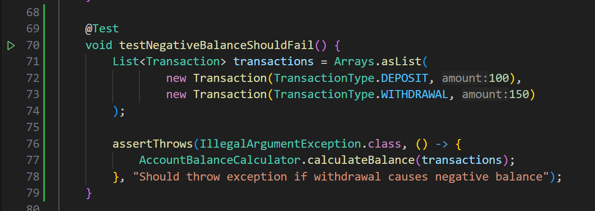
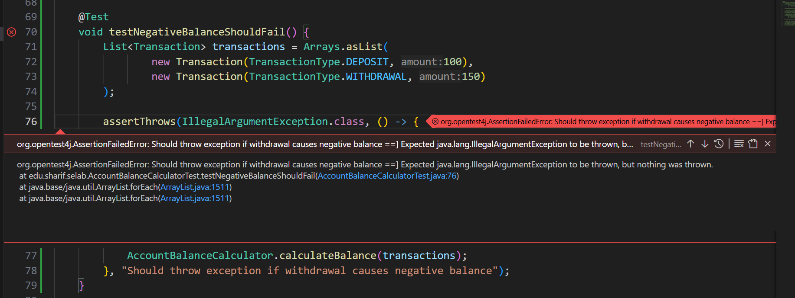
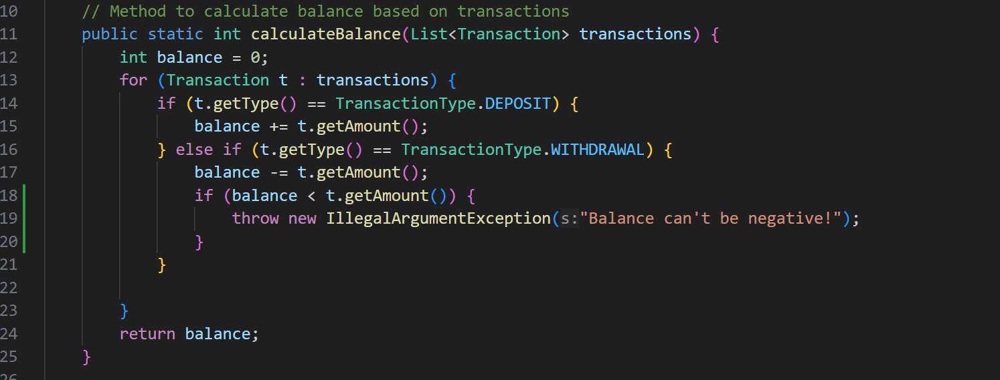
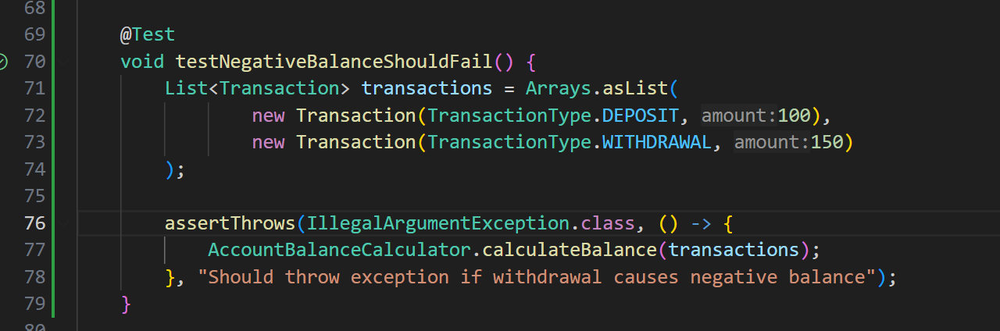

# مدیریت حساب بانکی

## پرسش اول
مشکل این است که اگر تراکنش‌ها موجودی حساب را منفی کنند بدون هیچ مشکلی موجودی محاسبه می‌شود
و یک عدد منفی بر میگردد
در حالی که باید برنامه خطا بدهد، احتمالا دلیل دیده نشدن این است که تست ها بعد از نوشتن کد نوشته شده اند.

## پرسش دوم

آزمون:
کافی است آزمونی بنویسیم که در صورت منفی شدن موجودی حساب `IllegalArgumentException` باید پرتاب شود. 
 
به خطا خوردن آزمون: 
طبیعتا آزمون شکست میخورد 
 
اصلاح کد: 
 
موفقیت آزمون:
 

## پرسش سوم
وقتی آزمون‌ها پس از نوشتن کد اضافه شوند، ممکن است فقط سناریوهای واضح یا مثبت را پوشش دهند و بسیاری از خطاهای لبه‌ای یا منطقی در کد باقی بمانند.
علاوه براین اضافه‌کردن آزمون جدید ممکن است نیاز به تغییر در کد ایجاد کند و این تغییرات اگر بدون پوشش تستی مناسب انجام شوند، می‌توانند باعث بروز خطاهایی شوند که تشخیص داده نشوند.
نوشتن آزمون‌های جدید بدون دید جامع نسبت به رفتار کلی سیستم ممکن است باعث شود که این آزمون‌ها با تست‌های قبلی تناقض داشته باشند یا منطق برنامه را دچار ابهام کنند.